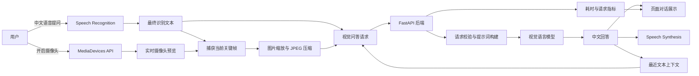
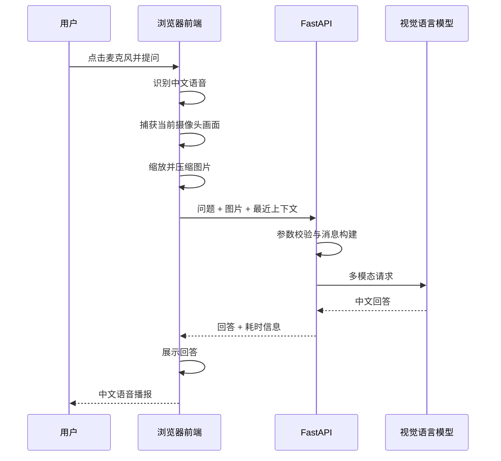

# SceneTalk

### 能看、能听、能连续交流的 AI 视觉对话助手

基于实时摄像头预览、中文语音交互与按需关键帧理解，让用户无需上传图片或输入文字，即可通过自然语言了解眼前的物品与场景。

**演示视频网盘链接：** https://pan.baidu.com/s/1UI5o-MnlvxDolu3xt6TUjQ?pwd=u66y

本项目按照功能模块拆分PR，保证每个PR聚焦单一功能点，并在主分支保持可运行状态，具体实际PR记录请以GitHub Pull Request页面为准。

**本项目仅用于七牛云 × XEngineer 暑期实训营作品展示与学习交流。** **如需进一步使用或改造，请遵守相关平台规则和知识产权要求。**

------

## 项目简介

SceneTalk 是一款运行在浏览器中的 AI 视觉对话助手。

用户开启摄像头后，可以直接使用中文语音提问。系统会在一轮提问结束时捕获当前摄像头关键帧，将压缩后的图像、用户问题和最近对话上下文发送给视觉语言模型，并以文字和中文语音返回回答。

项目形成了完整的多模态交互闭环：

```text
摄像头实时预览
      ↓
中文语音提问
      ↓
自动捕获关键帧
      ↓
前端图片压缩
      ↓
视觉模型理解
      ↓
文字回答与语音播报
      ↓
基于上下文继续追问
```

SceneTalk 不持续上传完整视频流，而是采用**按需关键帧采集**策略，在视觉理解能力、交互延迟、模型调用成本、用户隐私和浏览器兼容性之间取得平衡。

------

### Demo演示视频网盘链接：

 https://pan.baidu.com/s/1UI5o-MnlvxDolu3xt6TUjQ?pwd=u66y

### 产品宣传图（理想实现ui）


### 项目界面Demo

### 


------

## 核心亮点

### 1. 完整的视觉语音交互闭环

SceneTalk 将摄像头、语音识别、视觉理解、对话管理和语音合成串联成一条完整用户链路。

用户不需要：

- 手动拍照；
- 上传本地图片；
- 使用键盘输入；
- 重复描述上一轮提到的物品。

只需开启摄像头并说出问题，系统即可自动完成画面捕获、模型分析和语音回答。

------

### 2. 支持连续上下文追问

SceneTalk 会保留最近若干轮文本对话，使模型能够理解“它”“刚才那个物品”等指代表达。

示例：

```text
用户：我手里拿的是什么？它是什么颜色？

SceneTalk：你手里拿着一个红色水杯。

用户：它通常可以用来做什么？

SceneTalk：它通常可以用来盛放水、咖啡或其他饮品。
```

系统只发送有限轮次的文本上下文，不重复发送历史图片，既保证交互连续性，也避免模型输入无限增长。

------

### 3. 成本与延迟可视化

页面会展示每次视觉问答的真实运行指标：

```text
压缩前图片：1.82 MB
压缩后图片：168 KB
压缩率：90.8%
视觉模型耗时：2.36 s
端到端耗时：3.08 s
上下文轮数：2 / 4
```

这些指标用于帮助用户和开发者理解一次视觉请求的实际成本，而不是仅展示最终回答。

------

### 4. 按需关键帧采集

SceneTalk 不连续上传视频。

只有当用户完成一轮语音提问后，系统才会：

1. 从当前摄像头画面捕获一张关键帧；
2. 按比例缩小图像尺寸；
3. 转换并压缩为 JPEG；
4. 将图片和问题发送给后端；
5. 请求结束后释放当前图片数据。

该方案能够显著减少：

- 网络传输量；
- 视觉模型调用频率；
- 推理费用；
- 音视频同步复杂度；
- 服务端存储和隐私风险。

------

### 5. 面向真实使用场景的异常恢复

SceneTalk 对以下情况提供明确反馈和恢复入口：

- 用户拒绝摄像头权限；
- 用户拒绝麦克风权限；
- 浏览器不支持语音识别；
- 摄像头设备不可用；
- 语音没有识别到有效内容；
- 图片捕获或压缩失败；
- 模型响应超时；
- 模型返回空内容；
- 网络连接异常；
- 用户连续重复提交；
- 新提问打断上一轮语音播报。

------

## 用户场景

### 场景一：识别手中的物品

用户将物品展示在摄像头前，并询问：

> 我手里拿的是什么？它是什么颜色？

SceneTalk 捕获当前画面，识别主要物品和颜色，并通过文字与语音回答。

------

### 场景二：围绕同一物品继续追问

用户继续询问：

> 它一般可以用来做什么？

SceneTalk 根据上一轮文本上下文理解“它”的指代，无需用户重复物品名称。

------

### 场景三：描述当前环境

用户询问：

> 请描述一下桌面上的主要物品，并按照从左到右的顺序说明。

SceneTalk 根据当前关键帧生成简洁的场景描述。

------

### 场景四：获得画面调整建议

当画面过暗、模糊或主体被遮挡时，SceneTalk 不强行编造答案，而是提示用户：

> 当前画面较暗，无法准确判断。请将物品靠近摄像头并增加光线后重试。

------

## 功能完成情况

> 提交前只保留实际完成的项目。

| 模块     | 功能                       | 状态 |
| -------- | -------------------------- | ---- |
| 摄像头   | 权限申请与实时预览         | ✅    |
| 摄像头   | 当前关键帧捕获             | ✅    |
| 摄像头   | 页面退出时释放媒体轨道     | ✅    |
| 语音     | 中文语音识别               | ✅    |
| 语音     | 临时识别文本展示           | ✅    |
| 语音     | 中文语音播报               | ✅    |
| 语音     | 停止上一轮播报             | ✅    |
| 视觉问答 | 图片与问题联合提交         | ✅    |
| 视觉问答 | 真实视觉模型调用           | ✅    |
| 上下文   | 最近对话轮次管理           | ✅    |
| 成本控制 | 图片尺寸限制与 JPEG 压缩   | ✅    |
| 成本控制 | 压缩率和耗时统计           | ✅    |
| 稳定性   | 超时、空响应与网络异常处理 | ✅    |
| 稳定性   | 防止重复请求               | ✅    |
| 工程化   | 前后端环境变量管理         | ✅    |
| 工程化   | 测试与设计文档             | ✅    |

------

## 系统架构



------

## 核心请求流程



------

## 关键设计决策

### 为什么不持续上传完整视频流

连续视频分析能够提供更多时序信息，但也会带来：

- 更高的网络带宽消耗；
- 更高的视觉模型调用费用；
- 更复杂的帧采样和音视频同步逻辑；
- 更高的浏览器性能压力；
- 更复杂的服务端并发管理；
- 更大的隐私风险。

SceneTalk 当前聚焦于：

- 物品识别；
- 颜色与特征判断；
- 当前场景描述；
- 基于上下文的连续追问。

这些用户故事主要依赖提问时的当前画面，因此一轮一张关键帧能够满足核心需求。

------

### 为什么语音能力放在浏览器端

SceneTalk 使用浏览器语音识别和语音合成能力完成基础语音交互。

这样可以减少：

- 额外的音频文件上传；
- 云端 ASR 和 TTS 调用次数；
- 服务端音频转码流程；
- 音频存储和隐私风险；
- 端到端交互延迟。

视觉模型只负责必须在云端完成的图像理解任务。

------

### 为什么只保留有限上下文

系统只保留最近若干轮文本对话，主要用于：

- 理解“它”“刚才那个物品”等指代；
- 支持自然连续追问；
- 避免对话历史无限增长；
- 控制模型输入长度和调用成本；
- 降低历史信息干扰当前回答的概率。

当前版本不重复发送历史图片。

------

### 为什么模型密钥只放在后端

视觉模型 API Key 只由 FastAPI 后端读取。

前端只能访问 SceneTalk 自身接口，无法获得模型密钥，从而避免：

- 密钥暴露在浏览器源码中；
- 密钥被用户直接复制；
- 用户绕过业务逻辑调用模型；
- 请求限额被恶意消耗。

------

## 技术栈

### 前端

- Vue 3
- TypeScript
- Vite
- Pinia
- MediaDevices API
- Canvas API
- Web Speech API
- SpeechSynthesis API
- Lucide Vue Next

### 后端

- Python 3.11
- FastAPI
- Pydantic
- Uvicorn
- OpenAI-compatible SDK

### AI 能力

- 支持图片输入的视觉语言模型
- 中文视觉问答
- 多轮文本上下文
- 基于提示词的幻觉约束

### 开发辅助

- Claude Code
- DeepSeek-V4

Claude Code 与 DeepSeek-V4 用于辅助代码生成、重构、测试和文档整理，不承担 SceneTalk 运行时的视觉理解任务。

所有 AI 生成内容均经过人工检查、运行验证和修改。

------

## 项目结构

```text
SceneTalk/
├─ frontend/
│  ├─ src/
│  │  ├─ api/
│  │  │  └─ visionChat.ts
│  │  ├─ components/
│  │  │  ├─ CameraStage.vue
│  │  │  ├─ VoiceControl.vue
│  │  │  ├─ ConversationPanel.vue
│  │  │  ├─ MetricsPanel.vue
│  │  │  ├─ PermissionGuide.vue
│  │  │  └─ StatusBadge.vue
│  │  ├─ composables/
│  │  │  ├─ useCamera.ts
│  │  │  ├─ useImageCapture.ts
│  │  │  ├─ useSpeechRecognition.ts
│  │  │  └─ useSpeechSynthesis.ts
│  │  ├─ stores/
│  │  │  └─ conversation.ts
│  │  ├─ types/
│  │  │  └─ index.ts
│  │  ├─ utils/
│  │  │  ├─ imageCompression.ts
│  │  │  └─ errors.ts
│  │  ├─ views/
│  │  │  └─ HomeView.vue
│  │  ├─ App.vue
│  │  └─ main.ts
│  ├─ .env.example
│  ├─ package.json
│  └─ vite.config.ts
├─ backend/
│  ├─ app/
│  │  ├─ api/
│  │  │  └─ vision_chat.py
│  │  ├─ core/
│  │  │  └─ config.py
│  │  ├─ schemas/
│  │  │  └─ vision_chat.py
│  │  ├─ services/
│  │  │  ├─ vision_client.py
│  │  │  └─ prompt_builder.py
│  │  └─ main.py
│  ├─ tests/
│  ├─ .env.example
│  └─ requirements.txt
├─ docs/
│  ├─ assets/
│  ├─ design.md
│  └─ test-report.md
├─ CLAUDE.md
├─ README.md
├─ .gitignore
└─ LICENSE
```

> 如果实际目录与上述结构不同，请以真实项目结构为准修改。

------

## 快速开始

### 环境要求

- Node.js 20 或更高版本
- Python 3.11 或更高版本
- 最新版 Chrome 或 Edge
- 可调用视觉语言模型的 API Key

浏览器摄像头和麦克风能力需要运行在：

- `localhost`
- 或 HTTPS 环境

------

### 1. 克隆项目

```bash
git clone 待替换为仓库地址
cd SceneTalk
```

------

### 2. 启动后端

进入后端目录：

```bash
cd backend
```

创建虚拟环境：

```bash
python -m venv .venv
```

Windows：

```bash
.venv\Scripts\activate
```

macOS / Linux：

```bash
source .venv/bin/activate
```

安装依赖：

```bash
pip install -r requirements.txt
```

复制环境变量：

Windows PowerShell：

```powershell
Copy-Item .env.example .env
```

macOS / Linux：

```bash
cp .env.example .env
```

配置 `.env`：

```env
APP_ENV=development
APP_HOST=0.0.0.0
APP_PORT=8000

VISION_API_KEY=待填写
VISION_BASE_URL=待填写
VISION_MODEL=待填写

VISION_TIMEOUT_SECONDS=30
MAX_HISTORY_ROUNDS=4
MAX_IMAGE_BYTES=500000
ALLOWED_ORIGINS=http://localhost:5173
```

启动后端：

```bash
uvicorn app.main:app --reload
```

验证健康检查：

```text
http://localhost:8000/api/v1/health
```

预期响应：

```json
{
  "status": "ok",
  "service": "scenetalk-api"
}
```

------

### 3. 启动前端

新建一个终端：

```bash
cd frontend
npm install
```

复制环境变量：

Windows PowerShell：

```powershell
Copy-Item .env.example .env
```

macOS / Linux：

```bash
cp .env.example .env
```

前端 `.env`：

```env
VITE_API_BASE_URL=http://localhost:8000
VITE_APP_NAME=SceneTalk
```

启动：

```bash
npm run dev
```

访问：

```text
http://localhost:5173
```

------

## 使用方法

1. 打开 SceneTalk；
2. 点击“开启视觉助手”；
3. 允许浏览器访问摄像头和麦克风；
4. 将需要识别的物品放在摄像头前；
5. 点击麦克风按钮；
6. 使用中文提出问题；
7. 等待系统捕获画面并完成分析；
8. 查看文字回答并收听语音播报；
9. 围绕上一轮内容继续追问。

------

## 推荐体验问题

### 物品识别

```text
我手里拿的是什么？它是什么颜色？
```

### 连续追问

```text
它通常可以用来做什么？
```

### 场景描述

```text
请描述一下桌面上的主要物品。
```

### 空间顺序

```text
请按照从左到右的顺序说明画面中的物品。
```

### 简洁总结

```text
请用一句话总结当前场景。
```

------

## API 说明

### 健康检查

```http
GET /api/v1/health
```

------

### 视觉问答

```http
POST /api/v1/vision/chat
Content-Type: application/json
```

请求示例：

```json
{
  "question": "我手里拿的是什么？它是什么颜色？",
  "image": "data:image/jpeg;base64,...",
  "history": [
    {
      "role": "user",
      "content": "请描述刚才的物品。"
    },
    {
      "role": "assistant",
      "content": "刚才画面中有一个红色水杯。"
    }
  ],
  "clientMetrics": {
    "originalBytes": 1843200,
    "compressedBytes": 163840,
    "captureDurationMs": 38
  }
}
```

成功响应：

```json
{
  "requestId": "request-uuid",
  "answer": "你手里拿着一个红色水杯。",
  "model": "configured-vision-model",
  "latencyMs": 2380,
  "historyRounds": 1
}
```

错误响应：

```json
{
  "code": "VISION_MODEL_TIMEOUT",
  "message": "视觉分析等待时间过长，请重新提问。",
  "requestId": "request-uuid"
}
```

------

## 图片压缩策略

关键帧发送前执行以下处理：

1. 从 `<video>` 绘制到 `<canvas>`；
2. 保持原始宽高比；
3. 将最长边限制为 1024 像素；
4. 转换为 JPEG；
5. 使用初始质量系数压缩；
6. 如果图片仍超过大小限制，则继续降低质量；
7. 记录压缩前后大小；
8. 计算真实压缩率。

压缩率计算：

```text
压缩率 = (1 - 压缩后大小 / 压缩前大小) × 100%
```

------

## 隐私与安全

SceneTalk 遵循最小数据使用原则：

- 摄像头只在用户主动授权后开启；
- 页面退出时主动停止媒体轨道；
- 每轮问答只处理一张当前关键帧；
- 服务端不持久化保存摄像头图片；
- 日志不记录完整 Base64 图像；
- 不建立用户画像；
- 不进行人物身份识别；
- 模型 API Key 只存放在后端环境变量；
- `.env` 已加入 `.gitignore`；
- 前端不会获得视觉模型密钥。

------

## 提示词与回答约束

视觉模型被要求：

- 只描述画面中可以合理确认的内容；
- 无法确认时明确表达不确定；
- 不编造图片中不存在的内容；
- 不识别或猜测真实人物身份；
- 优先使用简洁自然的中文；
- 回答长度适合直接语音播报；
- 画面过暗或模糊时提示用户调整；
- 结合最近对话理解必要的指代表达。

------

## 测试

### 前端构建

```bash
cd frontend
npm run build
```

### 后端测试

```bash
cd backend
pytest
```

### 主要手动测试场景

| 测试场景             | 预期结果                     |
| -------------------- | ---------------------------- |
| 摄像头授权成功       | 正常显示实时画面             |
| 摄像头权限拒绝       | 显示授权指引和重试入口       |
| 麦克风授权成功       | 可以识别中文语音             |
| 浏览器不支持语音识别 | 显示浏览器兼容性提示         |
| 物品识别             | 返回与当前画面相关的回答     |
| 连续追问             | 能够理解上一轮指代           |
| 模型超时             | 停止加载并允许重新提问       |
| 网络异常             | 显示明确错误，不导致页面崩溃 |
| 连续点击             | 不产生重复模型请求           |
| 播报中开始新提问     | 停止上一轮语音播报           |
| 页面退出             | 摄像头媒体轨道正常释放       |

完整测试记录见：

[docs/test-report.md](https://chatgpt.com/c/docs/test-report.md)

------

## 第三方能力与原创实现

### 第三方能力

| 能力                | 用途               |
| ------------------- | ------------------ |
| Vue 3               | 前端页面和组件体系 |
| Pinia               | 对话状态管理       |
| FastAPI             | 后端接口和模型代理 |
| MediaDevices API    | 摄像头访问         |
| Canvas API          | 当前视频帧捕获     |
| Web Speech API      | 中文语音识别       |
| SpeechSynthesis API | 中文语音播报       |
| 视觉语言模型 API    | 图片内容理解       |

### 本项目原创实现

- 摄像头、语音和视觉问答的完整交互编排；
- 用户提问结束后的按需关键帧捕获机制；
- 图片尺寸限制与动态压缩流程；
- 有界文本上下文管理；
- 视觉请求状态机；
- 模型调用耗时与端到端耗时统计；
- 压缩率可视化；
- 统一的权限、网络和模型错误处理；
- 新问题自动中断旧回答播报；
- 产品页面、用户流程和交互体验设计。

------

## AI 辅助开发说明

项目开发过程中使用 Claude Code 和 DeepSeek-V4 辅助完成：

- 代码骨架生成；
- 局部功能实现；
- 类型和接口检查；
- 重构建议；
- 测试用例补充；
- 文档初稿整理。

AI 工具不替代项目设计和工程验证。

所有代码均经过：

- 人工审查；
- 本地运行；
- 前后端联调；
- 构建检查；
- 功能测试；
- 异常场景验证。

运行时视觉理解由单独配置的视觉语言模型完成，DeepSeek-V4 不直接处理用户摄像头图片。

------

## 已知限制

- 当前版本采用单轮关键帧输入，不持续理解完整视频流；
- 视觉识别准确性会受到光线、遮挡、分辨率和物品角度影响；
- 中文语音识别依赖浏览器能力，推荐使用最新版 Chrome 或 Edge；
- 浏览器摄像头和麦克风能力要求 localhost 或 HTTPS；
- 当前仅保留最近文本上下文，不保留历史图片；
- 网络质量会影响视觉模型响应时间；
- 当前不支持语音打断模型生成过程；
- 当前不进行真实人物身份识别；
- 当前没有用户账号和云端历史记录功能。

------

## 后续规划

- 增加画面变化检测，自动选择更有信息量的关键帧；
- 支持多帧联合理解；
- 支持更自然的语音打断和轮次切换；
- 支持低延迟流式文字回答；
- 支持本地视觉模型，增强隐私保护；
- 针对低视力用户优化按钮、语音提示和场景描述；
- 增加离线或弱网降级模式；
- 增加多语言语音交互。

------

## 设计文档

更完整的需求分析、架构设计、用户故事、成本控制和技术取舍见：

[docs/design.md](https://chatgpt.com/c/docs/design.md)

------

## 贡献

本项目目前用于暑期实训营议题作品提交。

欢迎通过 Issue 提交：

- 功能建议；
- 浏览器兼容性问题；
- 识别异常案例；
- 界面体验建议。


